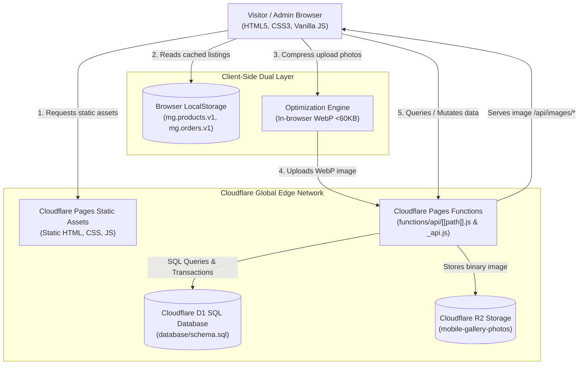
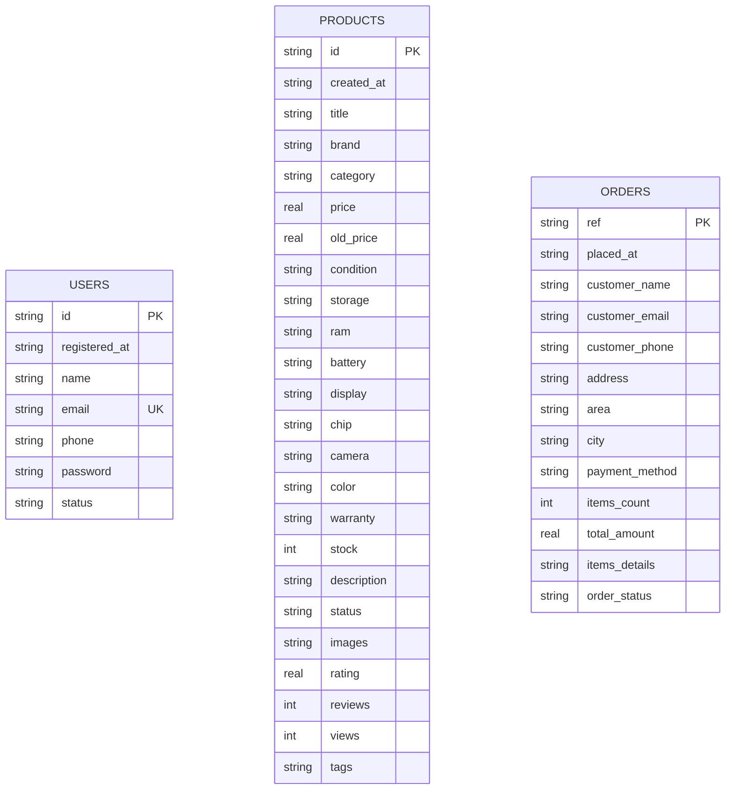

# 🏛️ System Architecture — Mobile Gallery

This document outlines the complete architectural design, data flow, component decomposition, and infrastructure topology of **Mobile Gallery**.

---

## 1. High-Level Architecture Topology

Mobile Gallery is engineered as an ultra-fast, edge-first, serverless e-commerce platform hosted globally on Cloudflare's network with zero cold-start latency.



---

## 2. Infrastructure & Cloudflare Components

| Component | Technology | Role & Responsibility |
| :--- | :--- | :--- |
| **Frontend CDN** | Cloudflare Pages Static Assets | Global distribution of static HTML, design token stylesheets, and obfuscated production scripts. |
| **API Layer** | Cloudflare Pages Functions | Serverless Edge REST and Action API (`functions/api/[[path]].js` & `functions/api/_api.js`). |
| **Primary Database** | Cloudflare D1 (`database/schema.sql`) | Serverless relational SQLite database storing structured records for `users`, `products`, and `orders`. |
| **Media Storage** | Cloudflare R2 (`mobile-gallery-photos`) | S3-compatible, zero-egress object storage for optimized product photos with public edge cache headers. |
| **Client-Side Cache** | Browser `localStorage` | Instant rendering layer providing optimistic UI updates, zero perceived latency, and offline resilience. |

---

## 3. Data Flow & Transaction Lifecycles

### 3.1 Storefront Product Browsing Flow
1. **Initial Load**: Client requests `index.html`. Browser loads design system `style.css` and scripts from Cloudflare edge.
2. **Cache Check**: `SheetEndpoint.fetchProducts()` retrieves local catalogue instantly from `localStorage` (`mg.products.v1`).
3. **Edge Synchronization**: In parallel, client queries `GET /api/products` (or POST `{ action: 'get_products' }`).
4. **D1 Query**: Pages Function executes `SELECT * FROM products ORDER BY rowid DESC`, parses JSON columns (`images`, `tags`), and returns product entities.
5. **UI Update**: Frontend merges remote data with local state and updates storefront DOM seamlessly.

### 3.2 Product Photo Upload & Optimization Flow (R2)
1. **Admin Selection**: Admin selects or drag-and-drops raw product images (5–15 MB each) in `admin.html`.
2. **In-Browser Compression**: `Optimization.batch()` compresses images using HTML5 Canvas to 720×720 WebP (<60 KB), saving 95%+ bandwidth.
3. **R2 Upload**: Compressed WebP data is transmitted via `POST /api/upload`.
4. **Bucket Storage**: Pages Function receives the binary buffer and writes to `env.PHOTOS_BUCKET.put('products/mg_...webp', buffer, { httpMetadata })`.
5. **Edge URL Delivery**: Pages Function returns the persistent URL `/api/images/products/mg_...webp`, which is stored in the product record.

### 3.3 Checkout & Stock Decrement Transaction Flow
1. **Order Submission**: Customer places an order on `checkout.html` via `SheetEndpoint.placeOrder()`.
2. **Batch Transaction**: Pages Function invokes `env.DB.batch([...])`:
   - Inserts order record into `orders` table.
   - For every item in the order, executes:
     ```sql
     UPDATE products SET stock = MAX(0, stock - ?) WHERE id = ?;
     ```
3. **Confirmation**: Customer receives confirmed order reference (`MG-XXXXX`), and stock is decremented immediately across the catalog.

---

## 4. Database Schema Design (Cloudflare D1)



### Table Specifications:
- **`users`**: Customer accounts and admin profiles. Enforces unique email constraint and indexed access status.
- **`products`**: Product catalogue with technical specifications, pricing, stock levels, and JSON-encoded image URL arrays.
- **`orders`**: Placed orders, customer delivery metadata, line items details (JSON array), and fulfillment lifecycle states.

---

## 5. Security Architecture

1. **Authentication & Session Isolation**:
   - Fixed Administrator authentication (`admin@mobilegallery.com` / `admin123`) verified with session storage flags.
   - Real-time customer access status checks (`Active`, `Inactive`, `Suspended`). Inactive or suspended accounts are rejected at the edge.
2. **SQL Injection Defense**:
   - 100% of Cloudflare D1 database operations use prepared statements with strict parameter binding (`env.DB.prepare(...).bind(...)`).
3. **Bot & Spam Mitigation**:
   - Honeypot form fields (`website_url`, `_hp`) silently trap automated scrapers and spammers.
4. **CORS Governance**:
   - Global CORS headers (`Access-Control-Allow-Origin: *`, standard safe methods, pre-flight caching) enabled across all `/api/*` endpoints.
