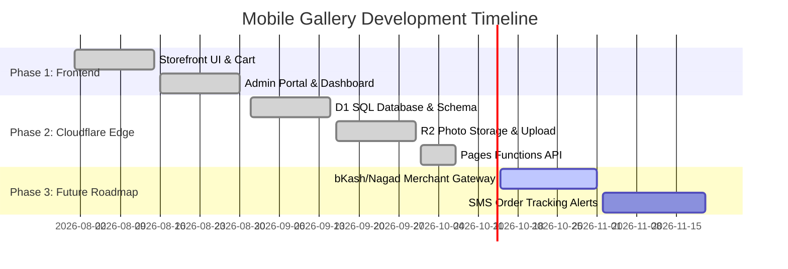

# 📋 Tasks & Roadmap Tracker — Mobile Gallery

This document tracks all completed engineering milestones, active development tasks, and the upcoming production roadmap for **Mobile Gallery**.

---

## 1. Milestones Overview

---

## 2. Completed Milestones & Tasks

### ✅ Milestone 1: Core Storefront & 3D Design System
- [x] Responsive layout with sticky topbar, category rail, and footer.
- [x] Renamed primary storefront navigation link from "Shop" to "Home".
- [x] Root directory organization with `index.html` as the primary entry point and secondary pages (`categories.html`, `admin.html`, `checkout.html`, `orders.html`, `404.html`) relocated into `assets/`.
- [x] Dedicated Categories & Catalogue page (`assets/categories.html`) with full sidebar filters and auto infinite scroll.
- [x] Clean Home page experience (`index.html`) featuring Hero search, Category Cards, and Featured Hot Deals grid.
- [x] Streamlined navigation by removing "Why us" and "Help" buttons and their associated content sections.
- [x] 3D perspective physics, spring easing, and dynamic device color palettes (`PALETTES`).
- [x] Real-time multi-attribute live search (filtering titles, brands, processors).
- [x] Product quick-view modal with detailed technical specifications and battery health.
- [x] Wishlist favorites engine with badge counter.
- [x] Dual-theme light/dark mode switcher with persistent user preference.

### ✅ Milestone 2: Shopping Cart & Checkout Pipeline
- [x] Slide-out glassmorphic cart drawer with quantity steppers and line item deletion.
- [x] Nationwide free delivery threshold indicator (orders over ৳30,000).
- [x] Checkout form with address collection, city dropdowns, and BD phone number validation.
- [x] Payment selection (Cash on Delivery, bKash, Nagad).
- [x] Unique order reference generation (`MG-XXXXX`) and instant confirmation dialog.

### ✅ Milestone 3: Admin Management Portal
- [x] Fixed credential security layer (`admin@mobilegallery.com` / `admin123`).
- [x] Cloud database telemetry monitor displaying live product, order, and user counts with latency gauge.
- [x] Product creator & inline editor with swatch picker, warranty, and status management (`Active` / `Paused`).
- [x] Low stock priority sorting (`1, 2, 3...` stock items shown first by default) with prominent badges (`⚠️ Low Stock`).
- [x] Separate, distinct action buttons for `🟢 Active` and `⏸️ Pause` on each product card in Manage Products.
- [x] Automatic storefront hiding of `Paused` items from customer browsing and search results.
- [x] Manage Products filter toolbar with live counter chips (`All`, `⚡ Low Stock`, `🟢 Active`, `⏸️ Paused`), search bar, and sort dropdown.
- [x] Order fulfillment pipeline with status filters (`Pending`, `Confirmed`, `Delivered`, `Cancelled`).
- [x] Customer access control allowing one-click account suspension (`Active`, `Inactive`, `Suspended`).

### ✅ Milestone 4: Cloudflare Pages Functions, D1 & R2 Migration
- [x] Created `database/schema.sql` provisioning D1 tables (`users`, `products`, `orders`) with indexes.
- [x] Generated `database/seed.sql` populating all 24 built-in smartphone listings and admin profile.
- [x] Implemented in-browser HTML5 canvas image optimizer (`Optimization.batch()`) compressing photos to `<60 KB` WebP.
- [x] Built Cloudflare R2 upload endpoint (`POST /api/upload`) and streaming edge server (`GET /api/images/*`).
- [x] Architected modular Edge API router in `functions/api/_api.js` supporting REST and legacy RPC actions.
- [x] Built Cloudflare Pages Functions catch-all in `functions/api/[[path]].js`.
- [x] Authored comprehensive deployment manual in `docs/CLOUDFLARE_DEPLOYMENT.md`.

### ✅ Milestone 5: Verification Suite & Documentation
- [x] Automated project integrity check (`tests/check-project.mjs`).
- [x] Core test suite for catalogue, cart, and asset links (`tests/verify-suite.mjs`).
- [x] Cloudflare Pages Functions, D1 database, and R2 photo storage integration tests (`tests/test-cloudflare-api.mjs`).
- [x] Authored all 7 documentation files in `docs/` (`ARCHITECTURE.md`, `CLOUDFLARE_DEPLOYMENT.md`, `DESIGN.md`, `MEMORY.md`, `PRD.md`, `RULES.md`, `TASKS.md`).

---

## 3. Upcoming Roadmap (Milestones 6 & Beyond)

### 📌 Milestone 6: Automated Digital Payment Gateway Integration
- [ ] Implement bKash Checkout URL-based payment API in Cloudflare Pages Functions.
- [ ] Implement Nagad Merchant API callback verification.
- [ ] Auto-mark orders as `Paid` upon successful webhook callback from payment provider.

### 📌 Milestone 7: Automated SMS Notification Gateway
- [ ] Connect Bangladeshi SMS gateway (Greenweb / Elitbuzz / Infobip).
- [ ] Send instant SMS confirmation to customer mobile number upon order placement.
- [ ] Send dispatch SMS alert with courier tracking code when order is marked `Delivered`.

### 📌 Milestone 8: Telemetry & Edge Analytics
- [ ] Integrate Cloudflare Web Analytics for zero-cookie traffic monitoring.
- [ ] Core Web Vitals (LCP, FID, CLS) performance dashboard.

---

## 4. Pre-Release Verification Checklist

Every pull request or deployment must verify:
- [x] `npm run build` generates clean, validated obfuscated code in `assets/js/`.
- [x] `npm test` passes 100% of checks with 0 errors.
- [x] `database/schema.sql` matches the entity model in `docs/ARCHITECTURE.md`.
- [x] All 7 files in `docs/` are in sync with the codebase.
